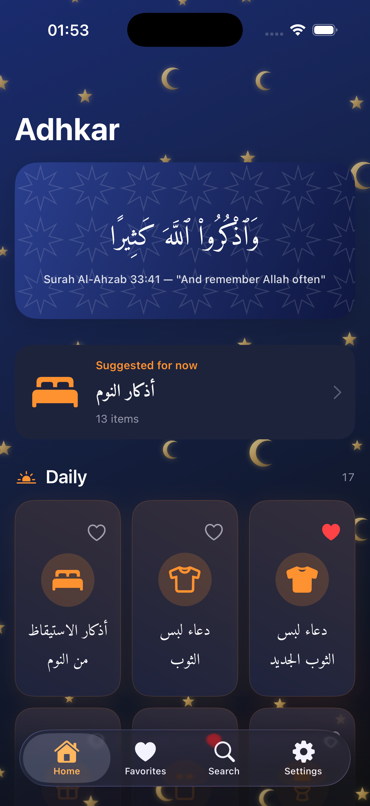
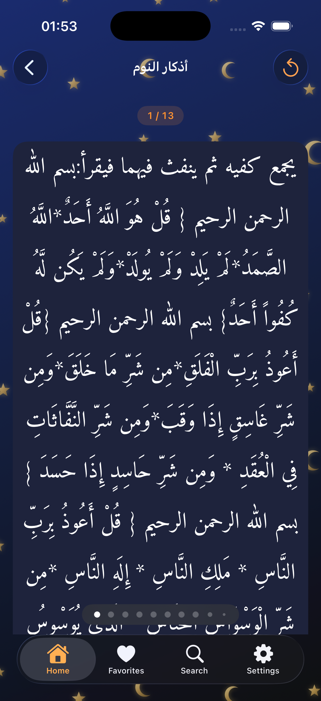
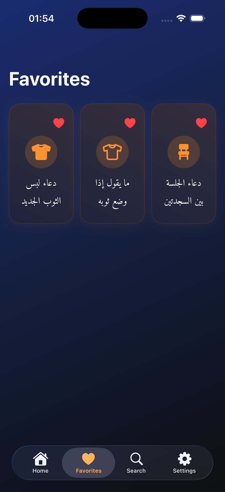
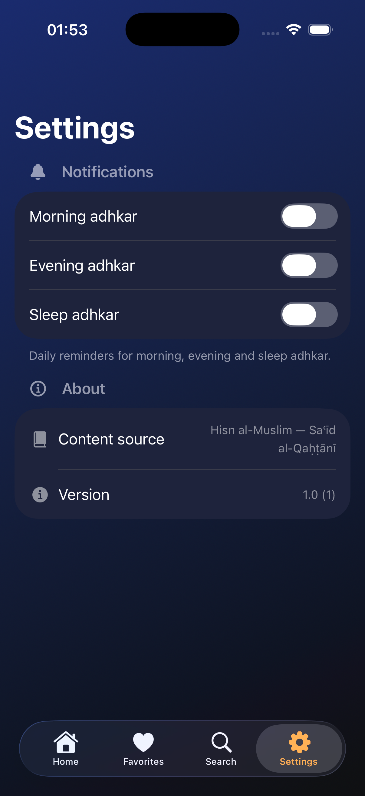

# Munajat — Dhikr & Dua

> **مناجاة** — intimate prayer, whispered remembrance of Allah.

A personal SwiftUI app for daily Islamic adhkar (remembrances) — morning, evening, sleep, prayer, travel, and more. Built around the *Hisn al-Muslim* corpus with Arabic text, translations, audio recitations and per-item counters.

Targets **iOS 18.4 / macOS 15.4 / visionOS** from a single codebase.

---

## Screenshots

<p align="center">
  
  
  
  
</p>

<p align="center"><sub>Home · Dhikr detail with counter · Favorites · Settings</sub></p>

---

## Features

- **133 categories / ~294 items** from *Hisn al-Muslim* (rn0x + wafaaelmaandy sources)
- **Trilingual UI**: Arabic, French, English — switchable at launch via `AppleLanguages`
- **Streaming audio** for each dhikr (hisnmuslim.com), upgraded to HTTPS at play time to clear iOS ATS
- **Per-item counters** persisted with SwiftData, auto-reset on day change
- **Favorites** with UserDefaults migration from the legacy per-key Bool format
- **Daily reminders** (morning / evening / sleep) via `UNCalendarNotificationTrigger`
- **Time-aware home**: surfaces the right category for the current hour as a featured card
- **Custom Arabic typography**: Amiri Regular/Bold for body, AmiriQuran for verses (full diacritics, registered at runtime via `CTFontManager`)
- **Islamic visual language**: gold crescents + 8-point stars over a deep-navy theme, drawn with `Canvas` and `Path.subtracting` for clean shapes

## Tech stack

- **SwiftUI** with `@Observable` state, `NavigationStack`, `TabView`
- **SwiftData** for the dhikr counter
- **AVFoundation** for audio streaming with `.spokenAudio` session
- **CoreText** for runtime font registration (no `UIAppFonts` in Info.plist)
- **UserNotifications** for daily reminders
- Cross-platform: no `import UIKit`, asset-catalog colors instead of `UIColor.secondarySystemBackground`, `.sensoryFeedback` instead of `UIImpactFeedbackGenerator`

## Architecture highlights

- **Xcode 26 synchronized folders** (`PBXFileSystemSynchronizedRootGroup`): any file dropped in `Adhkar/` auto-bundles
- **Single accent color** (orange) across every section to keep the visual language coherent
- **`LocalizedText`** reads `UserDefaults` `AppleLanguages` rather than `Locale.current`, so launch flags (`-AppleLanguages "(fr)"`) and per-app language settings are honored
- **Crescent shapes** use `Path.subtracting(_:)` (iOS 16+) instead of the naive `addEllipse + eoFill` ring which notches when the inner disk sticks out of the outer

## Build & run

The project ships with `.mcp.json` configured for [XcodeBuildMCP](https://github.com/xcode-build-mcp/xcodebuildmcp) — preferred over raw `xcodebuild` for build / install / launch / screenshot / unit tests.

Fallback raw command:

```bash
xcodebuild -project Adhkar.xcodeproj -scheme Adhkar \
  -destination 'generic/platform=iOS Simulator' -configuration Debug build
```

A booted simulator can be launched with:

```bash
SIM_ID=$(xcrun simctl create "Test" "iPhone 16" "com.apple.CoreSimulator.SimRuntime.iOS-18-5")
xcrun simctl boot $SIM_ID
xcrun simctl install $SIM_ID path/to/Adhkar.app
xcrun simctl launch $SIM_ID com.tadevv.Adhkar
# Force language at launch
xcrun simctl launch $SIM_ID com.tadevv.Adhkar -AppleLanguages "(fr)" -AppleLocale "fr_FR"
```

## Content generation

The bundled `Adhkar/adhkar.json` is regenerated from upstream sources:

```bash
# Needs /tmp/hisn_ar.json (rn0x/hisn_almuslim_json) and /tmp/husn_en.json (wafaaelmaandy)
python3 scripts/build_adhkar.py

# App icon (iOS light/dark/tinted + every macOS resolution)
python3 scripts/make_icon.py
```

The merge uses two-phase Jaccard matching on token sets (chapter → chapter, then item → item) — coverage went from ~48 % in the V1 prefix matcher to **94–95 %**.

## Project layout

```
Adhkar/                     # SwiftUI sources (auto-bundled via synchronized folder)
  adhkar.json               # Bundled corpus
  Amiri*.ttf                # Three bundled Arabic fonts
  Assets.xcassets/          # App icon, accent color, CardBackground
scripts/
  build_adhkar.py           # Hisn al-Muslim merger
  make_icon.py              # Icon renderer
CLAUDE.md                   # Project guide (architecture, gotchas, conventions)
```

## Credits

- **Hisn al-Muslim** by Sa'id bin Ali bin Wahaf al-Qahtani — the source corpus
- [rn0x/hisn_almuslim_json](https://github.com/rn0x/hisn_almuslim_json) — Arabic text, audio URLs, sources
- [wafaaelmaandy/Hisn-Muslim-Json](https://github.com/wafaaelmaandy/Hisn-Muslim-Json) — English translations
- [Amiri font](https://github.com/aliftype/amiri) by Khaled Hosny — Arabic typography
- Audio hosted by hisnmuslim.com

## Status

Personal project, not yet on the App Store. Built across seven explicit phases (bug fixes → JSON migration → content import → UX redesign → SwiftData/audio → notifications/i18n → polish/icon).
